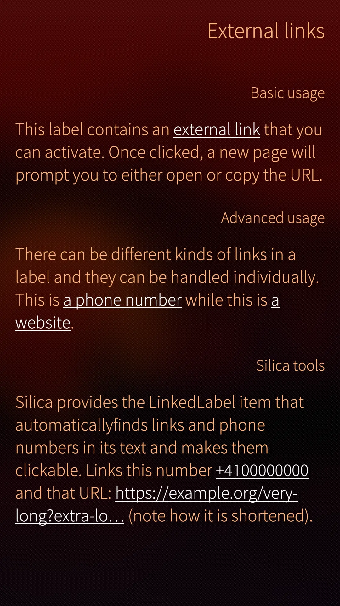

<!--
SPDX-FileCopyrightText: 2023-2025 Mirian Margiani
SPDX-License-Identifier: GFDL-1.3-or-later
-->

# Template for new Opal modules

Copy this repository to setup a new Opal module.

- [ ] Create a local copy of the contents of this repository.
- [ ] Run `setup.sh` and follow the instructions.
- [ ] Import your source code to `Opal/MyModule/` and/or `src/` and write documentation.
- [ ] Add an example to `README.md`.
- [ ] Update `release-module.sh`: if your module has no translations, set `cTRANSLATE=(Opal)` to `cTRANSLATE=()`
- [ ] Remove this introduction from `README.md`.
- [ ] Remove the `src/` or `Opal/` directories if your module is fully written in QML or in C++.
- [ ] Add screenshots to `doc/` and update `README.md` accordingly.
- [ ] Run `./release-module.sh` to build the docs and create a release bundle.

<hr>

# MyModule

Brief description of the module.

Longer description of which problem the module solves, and how it makes life easier.


## Usage

```{qml}
import QtQuick 2.0
import Sailfish.Silica 1.0
import Opal.MyModule 1.0

MyComponent {
    // ...
}
```

## Screenshots

Screenshots can be found in the [doc](doc/) directory.

<!--
| 1. | 2. |
|-|-|
|  |  |

| 1. | 2. | 3. |
|-|-|-|
|  |  |  |
-->

## How to use

You do not need to clone this repository if you only intend to use the module in
another project. Simply download the latest release bundle from the "Releases" page.

### Setup

Follow the main documentation for installing Opal modules
[here](https://github.com/Pretty-SFOS/opal/blob/main/README.md#using-opal).

### Configuration

See [`doc/gallery.qml`](doc/gallery.qml) for an example. Read the file to get
started.

### Documentation

Documentation is included in the release bundle and can be added to
QtCreator via Extras → Settings → Help → Documentation → Add.

## Translations

To **use** packaged translations in your project, follow the main documentation for
using Opal modules [here](https://github.com/Pretty-SFOS/opal#using-opal).

You can also **contribute** translations. If an app uses Opal modules, consider
updating its translations at the source (i.e. here), so that all Opal users can
benefit from it. Translations are managed using
[Weblate](https://hosted.weblate.org/projects/opal).

Please prefer Weblate over pull requests (which are still welcome, of course).
If you just found a minor problem, you can also
[leave a comment in the forum](https://forum.sailfishos.org/t/opal-qml-components-for-app-development/15801)
or [open an issue](https://github.com/Pretty-SFOS/opal/issues/new).

Please include the following details:

1. the language you were using
2. where you found the error
3. the incorrect text
4. the correct translation

See [the Qt documentation](https://doc.qt.io/qt-5/qml-qtqml-date.html#details) for
details on how to translate date formats to your local format.

## License

    Copyright (C)  Mirian Margiani
    Program: opal-mymodule

    This program is free software: you can redistribute it and/or modify
    it under the terms of the GNU General Public License as published by
    the Free Software Foundation, either version 3 of the License, or
    (at your option) any later version.

    This program is distributed in the hope that it will be useful,
    but WITHOUT ANY WARRANTY; without even the implied warranty of
    MERCHANTABILITY or FITNESS FOR A PARTICULAR PURPOSE.  See the
    GNU General Public License for more details.

    You should have received a copy of the GNU General Public License
    along with this program.  If not, see <http://www.gnu.org/licenses/>.
